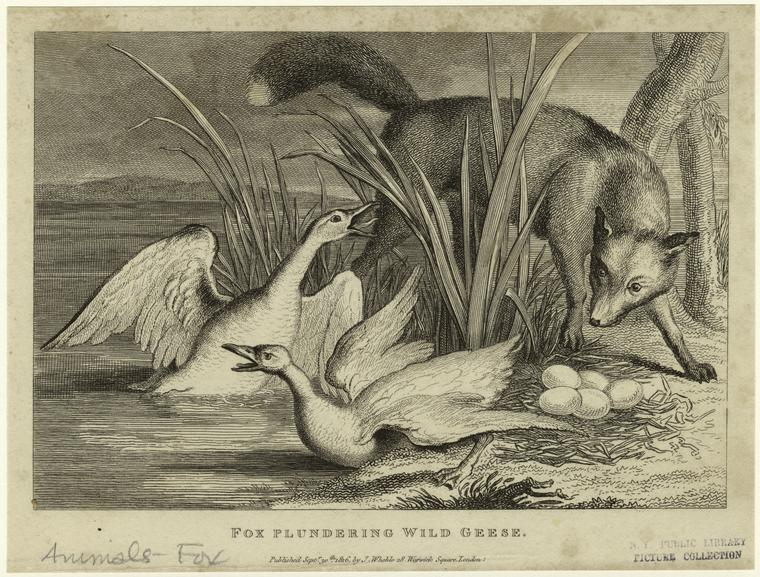

# Fox & Geese



This is a simple CLI game written in x86 assembly, it was a work for the computer organization course on the Faculty of Engineering, University of Buenos Aires.

## Rules

### Elements

The game is played on a board with thirty-three indentations, arranged in the shape of a cross.

Seventeen round pieces, similar to marbles of the same color will represent the geese, and another different one will be the fox.

### Objective

The player in possession of the fox has the objective of capturing a minimum of twelve geese, through successive moves very similar to those made in the game of checkers. His opponent must avoid him.

### How the game is played

The game is played between two players. One of them has only one piece, the fox, which can move freely around the board. The other player has seventeen pieces, which are the geese, and is limited by some very restricted movements.

- The fox is the one that starts the game and can move in any direction: forward, backward, diagonally and sideways (one square at a time unless it eats a goose)
- To eat a goose, the fox must jump over it to an empty square, although he is not obliged to do so whenever he can. Multiple jumps are allowed
- The geese can move forward and sideways, but never diagonally or backward (one square at a time). As they cannot jump over the fox, they have to try to corner it so that it cannot move. Any goose hunted is removed from the board
- One move per turn and only one piece can be moved at a time
- The fox wins the game if it manages to catch a minimum of twelve geese

## Installation

To compile:

```bash
make
```

To run:

```bash
./foxngeese
```
